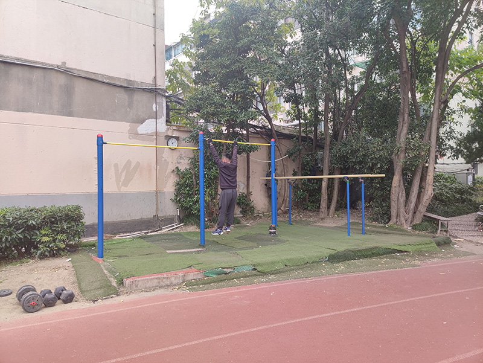
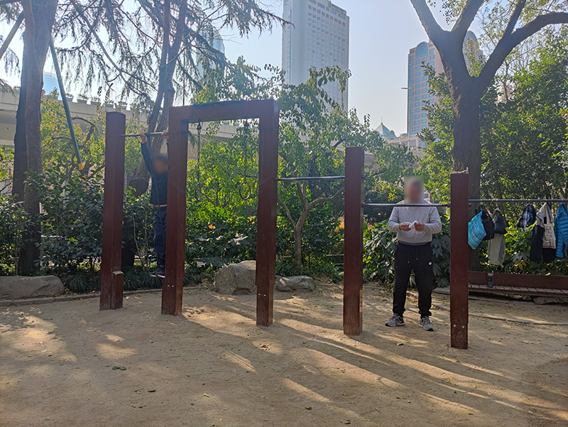
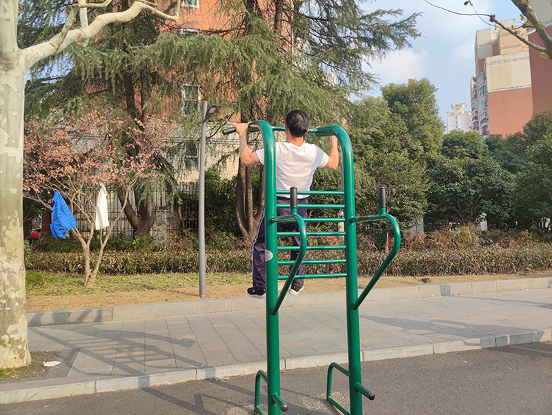

# China - Shanghai

- [China - Shanghai](#china---shanghai)
  - [Changfeng Park](#changfeng-park)
  - [Hongqiao Riverside Park](#hongqiao-riverside-park)
  - [Jing'an District Workers' Stadium](#jingan-district-workers-stadium)
  - [Jing'an Park](#jingan-park)
  - [Suzhou Creek and Jiaozhou Road](#suzhou-creek-and-jiaozhou-road)

## Changfeng Park

[Changfeng park (長風公園)](https://maps.app.goo.gl/jWjreubCrmQBoCaa8) is a landscaped park in the west of Shanghai. There is a sport yard close to the west gate with a few bars.

## Hongqiao Riverside Park

[Hongqiao Riverside Park (虹橋河濱公園)](https://maps.app.goo.gl/W4ub3FMcMQJQNRuW7) is at 2028 Changning Rd, Changning District. There are a few bars in the west side of the park by the Suzhou creek.

## Jing'an District Workers' Stadium

[Jing'an District Workers' Stadium (靜安區工人體育場)](https://maps.app.goo.gl/Lzumdhza7Fbw2V7u6) is at 888 Changping Road, near Jiaozhou Road, Jing'an District. There is a small sport yard in the west side with a few bars.

## Jing'an Park

[Jing'an Park (靜安公園)](https://maps.app.goo.gl/7w5eD8Wq5Qr8wV5X8) is a park located at the Western section of Nanjing Road, just opposite the Jing'an Temple in Shanghai, China. There is a sport yard in the south side with a few bars.

## Suzhou Creek and Jiaozhou Road

[Suzhou Creek and Jiaozhou Road (蘇州河和膠州路)](https://maps.app.goo.gl/VFoRbUkguQFvUQjL8) is at the west end of Jiaozhou Road, near Suzhou Creek. There is a small sport yard with a pull-up spot.

