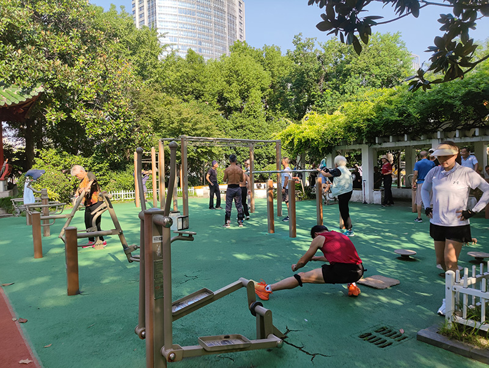

# China - Shanghai

## Changfeng Park

[Changfeng park (長風公園)](https://maps.app.goo.gl/jWjreubCrmQBoCaa8) is a landscaped park in the west of Shanghai, China. There is a sport yard close to the west gate with a few bars.

## Jing'an Park

[Jing'an Park (靜安公園)](https://maps.app.goo.gl/7w5eD8Wq5Qr8wV5X8) is a park located at the Western section of Nanjing Road, just opposite the Jing'an Temple in Shanghai, China. There is a sport yard in the south side with a few bars.

## Jing'an District Workers' Stadium

[Jing'an District Workers' Stadium (靜安區工人體育場)](https://maps.app.goo.gl/Lzumdhza7Fbw2V7u6) is at 888 Changping Road, near Jiaozhou Road, Jing'an District. There is a small sport yard in the west side with a few bars.
