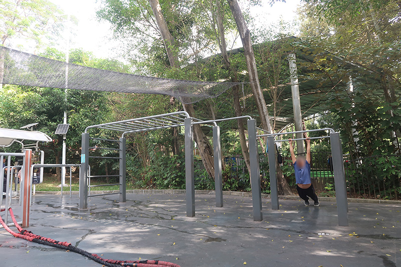

# China - Shenzhen

- [China - Shenzhen](#china---shenzhen)
  - [East Lake Park](#east-lake-park)

## East Lake Park

[East Lake Park (東湖公園)](https://maps.app.goo.gl/rKeDqin2Zv8DQh7G9) also known as Donghu Park, is a public urban park in Shenzhen. The park is located in Luohu District, with Mount Wutong standing in the east, Yanhe Road in the west, Shensha Road in the south, Aiguo Road in the north, covering an area of 1,525,900 square metres (16,425,000 sq ft). There is a sport yard right to the south of the gate ball field.

