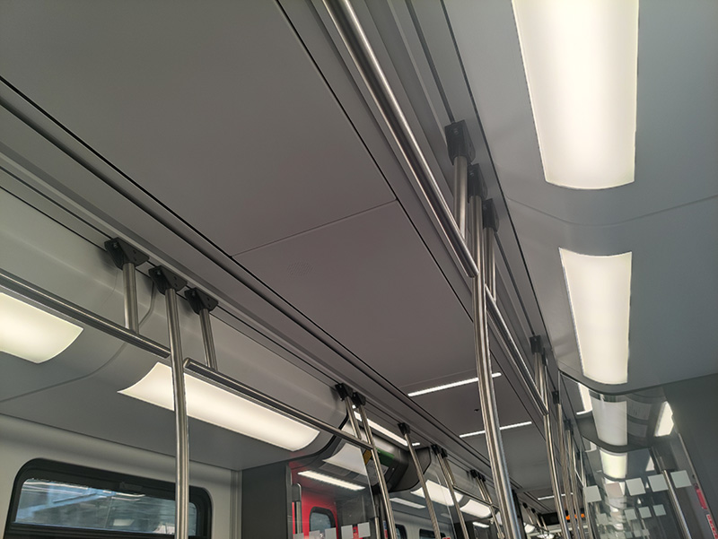
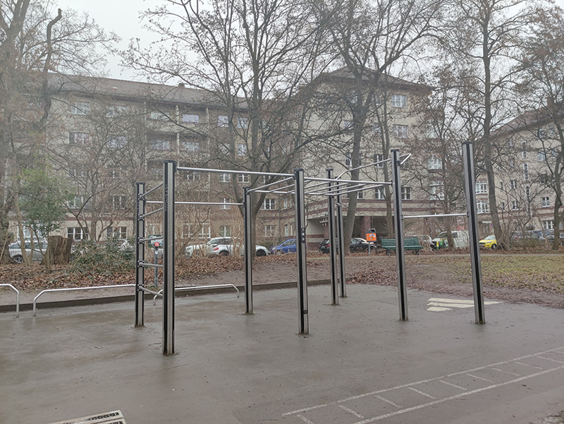
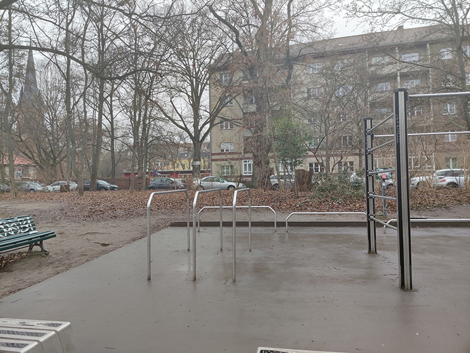
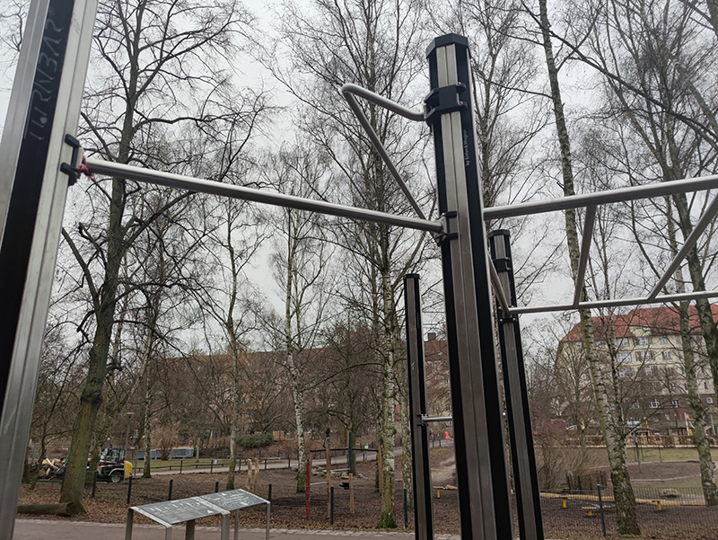
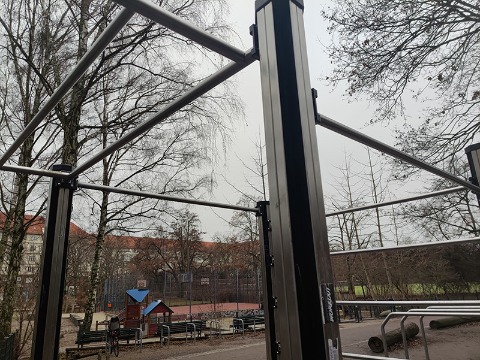

# Germany - Berlin

[Calisthenics Parks](https://calisthenics-parks.com/cities/16-en-berlin/equipments/1-en-pull-up-bar-chin-up-bar-horzontal-bar/spots)

## S-Bahn and U-Bahn

It's really hard to find a free pull-up spot in Berlin. Luckily, there are plenty of bars in the carriages of S-Bahn and U-Bahn. Those bars are great places to do pull-ups.

## Volkspark Wilmersdorf

The Volkspark Wilmersdorf is full of all kinds of calisthenics equipment.

Click to toggle more photos

